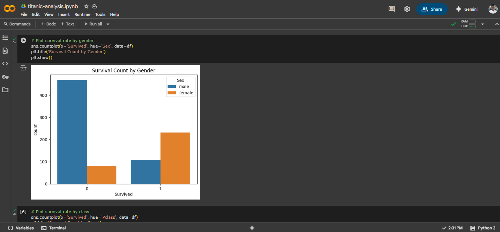

# Titanic Survival Analysis

This is a beginner-friendly data analysis project exploring survival patterns from the Titanic dataset.

## 📌 Objectives
- Explore basic data wrangling using Pandas
- Visualize relationships using Seaborn and Matplotlib
- Analyze survival patterns by gender and class

## 🛠 Tools Used
- Python (Pandas, Matplotlib, Seaborn)
- Jupyter Notebook
- GitHub

## 📈 Insights
- Females had a higher survival rate than males
- Passengers in 1st class were more likely to survive than those in 3rd

## 📂 Dataset Source
- [Titanic Dataset on GitHub](https://github.com/datasciencedojo/datasets/blob/master/titanic.csv)

## 📊 Sample Visualization

This chart shows the survival rate of passengers based on their gender.

